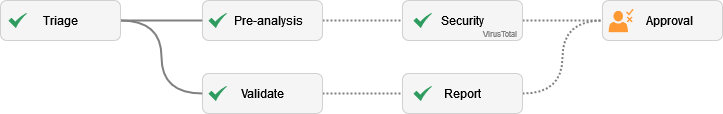
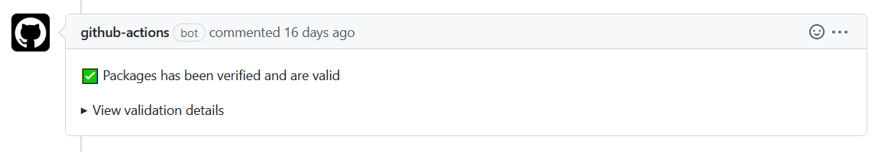
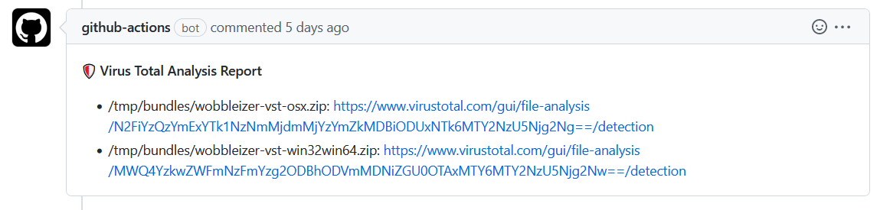

# OwlPlug Registry

[](https://github.com/OwlPlug/owlplug-registry/actions/workflows/deploy.yml)
[](https://discord.gg/nEdHAMB)


This repository contains package manifest files for the **OwlPlug** main registry. If you are an audio plugin developer, feel free to add your audio plugin releases to make them available on the **OwlPlug** registry.


## Submit a plugin

To submit a package to this repository, you should follow these simple steps:

* Follow the Contributing guidelines below.
* [Author](#author-a-package-manifest) a package manifest
* [Open](https://github.com/OwlPlug/owlplug-registry#open-your-pr) your pull request.
* Pull request will be validated by the [Automated Validation Pipeline](#automated-validation-pipeline)
* If the previous validation succeed, your PR will be eligible to [Human Approval](#human-approval) stage.

### Author a package manifest

Please, follow the [Package Creation Guidelines]()

#### Create a `package.yaml` file manually

```yml
name: WobbleIzer
slug: wobbleizer
creator: Dropsnorz
screenshotUrl: https://.../wobbleizer.png
description: A frequency filter with LFO modulation
pageUrl: https://github.com/dropsnorz/wobbleizer
type: effect
bundles:
- name: Wobx Win32/64
  targets:
  - win32
  - win64
  format: vst
  downloadUrl: https://.../wobbleizer-vst-win32win64.zip
  downloadSha256: 35f9446c4494e055938ebe46df60af5162949936416816582cc738a809ab5ccd
- name: Wobx Osx
  targets:
  - osx
  format: vst
  downloadUrl: https://..../wobbleizer-vst-osx.zip
  downloadSha256: 17b98b8eda7271f16ec82571bed34ab45192621c98fcada217cde7c54bddb793
```

#### Use the automated tool


```
WIP
```

### Automated validation pipeline

An automated validation pipeline will be run when the pull request is opened / updated. Any changes pushed to the PR source branches will trigger the validation pipeline.




#### Pull Request triage

Labels will be applied to your pull request based on updated files.

#### Pre-Analysis

This job checks files updated in your pull request and prepare input for the next jobs executions (Security/Antivirus)

#### Validate Packages

This job checks that package files created and / or updated are valid against the schema. Properties defined in the `package.yaml` are verified.

Your pull request will be commented with the analysis status.




#### Antivirus and Virus Total


All bundles referenced in your packages are submitted to [Virus Total](https://www.virustotal.com). Every file referenced by any field `downloadUrl` in a `package.yaml` file will be submitted for analysis by Virus Total services. By submitting data to this repository, you are agreeing to share your bundle binaries with the security community. Please do not submit any personal information through your binaries. For details about the service, you can check Virus Total [Terms of Service](https://support.virustotal.com/hc/en-us/articles/115002145529-Terms-of-Service) and [Privacy Policy](https://support.virustotal.com/hc/en-us/articles/115002168385-Privacy-Policy),

This analysis is required to track potentially dangerous files submitted to the registry. A package flagged with a bad score, or a score < 75% with common AV vendors will not be added to the registry. Even if it's a safe package, there is a high risk that the installation from OwlPlug will be disrupted by the end-user antivirus.

As there are often false positives, your plugin doesn't need to have a 100% VT pass score. All submissions will be reviewed and the result analysis will be checked by a human before approval.

Your pull request will be commented with a message to review your VT analysis results




### Human Approval

If your pull request is **Valid** against all automated checks, it will be queued for approval.
All pull requests will be reviewed and approved by a maintainer before merge.

## License

View [LICENSE.md](license.md) file.

